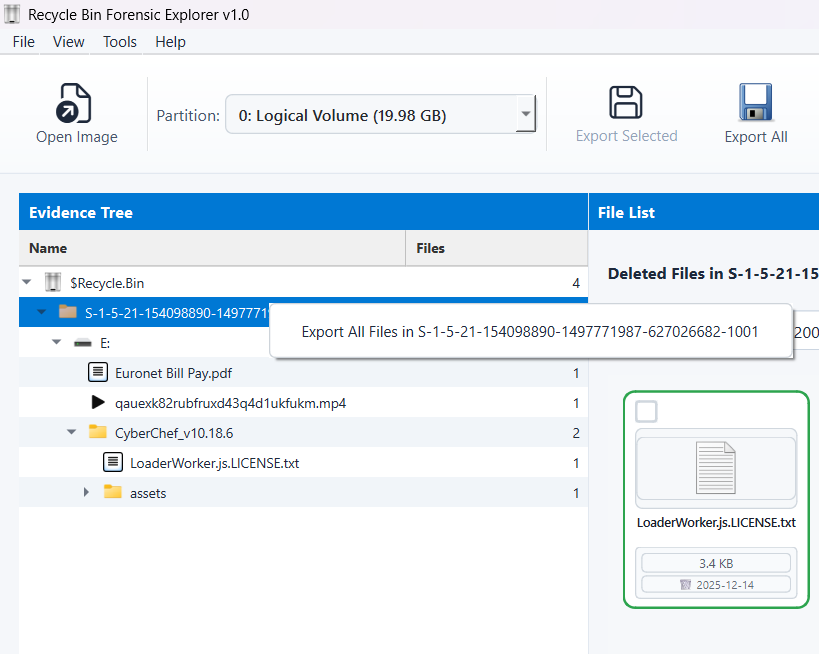
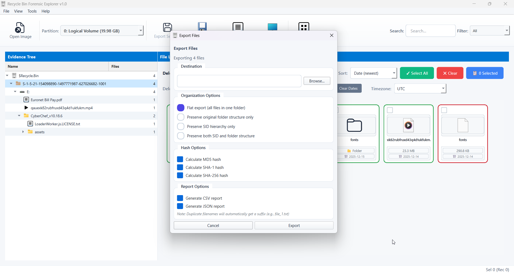
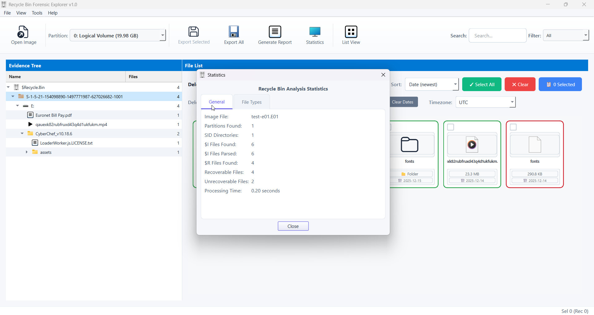
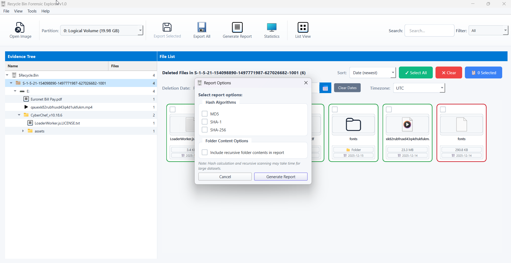
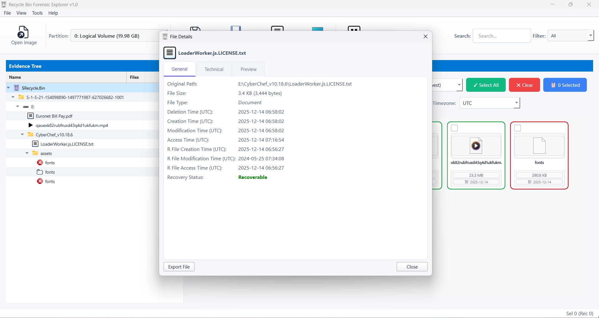
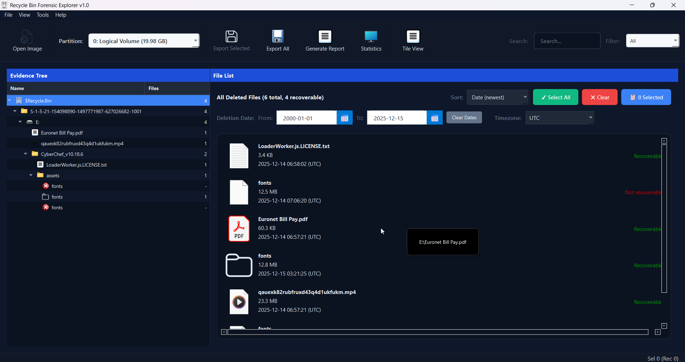
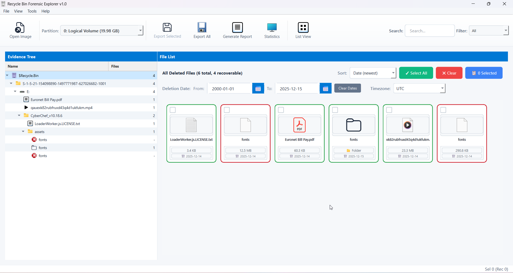

# 🗑️ RecycleBin Forensic Explorer

**A hassle-free GUI tool for Windows Recycle Bin forensic analysis - Browse deleted files without complex $I/$R parsing**


[](https://www.python.org/)
[](LICENSE)
[](https://github.com/akhil-dara)

## 🎯 Overview

RecycleBin Forensic Explorer is a user-friendly GUI application designed to quickly explore Recycle Bin artifacts directly from **E01 forensic images** for digital forensic investigators and cybersecurity professionals. This tool eliminates the complexity of manually parsing Windows Recycle Bin artifacts ($I and $R files) by providing an intuitive interface for quick browsing, analysis, and export of deleted file metadata.

The tool was created to solve real-world investigative challenges encountered when analyzing large volumes of `$I` files using traditional forensic tools that expose Recycle Bin data only as flat records.

## 🚨 Problem Addressed

Existing forensic approaches (including Windows and commercial DFIR tools):
- Display Recycle Bin artifacts in flat tables without context
- Do not allow browsing of deleted files in their original folder hierarchy
- Export deleted files using raw `$Rxxxx` filenames
- Require manual correlation between `$I` and `$R` files
- Become inefficient and error-prone at scale

**This tool focuses on context reconstruction, not just artifact extraction.**

### Why RecycleBin Forensic Explorer?

Traditional Recycle Bin forensics requires:
- ❌ Manual parsing of binary $I files for metadata extraction
- ❌ Complex command-line tools and scripts
- ❌ Matching $I files with corresponding $R files
- ❌ Time-consuming manual correlation of deleted file artifacts
- ❌ Loss of original directory structure context

**RecycleBin Forensic Explorer solves this by:**
- ✅ **Direct E01 image analysis** - Load forensic images without mounting
- ✅ **Partition selection** - Choose specific partitions to analyze
- ✅ **One-click analysis** of entire Recycle Bin structures
- ✅ **Visual evidence tree** showing deleted items in original hierarchy
- ✅ **Automatic $I/$R file parsing** with no manual intervention
- ✅ **Multiple export formats** (CSV, JSON, HTML reports)
- ✅ **Context-aware exports** - Restore original filenames and folder structures
- ✅ **Dark/Light mode** for comfortable analysis sessions
- ✅ **Detailed statistics** and timeline visualization

## 🚀 Key Features

### 🔍 Evidence Handling
- **Load E01 forensic images** directly without mounting
- **Partition selection support** - Choose which partition to analyze
- **Automatic discovery** of `$Recycle.Bin` folders
- **SID-based parsing** of Recycle Bin contents
- **Robust $I metadata parsing** with defensive error handling
- **Correlation of $I metadata** with corresponding $R files
- **Detection of missing $R content** entries

### 📂 Intelligent Parsing Engine
- Automatically parses Windows Vista/7/8/10/11 Recycle Bin structures
- Extracts metadata from $I files: original filename, path, deletion timestamp, and file size
- Maps $I metadata to corresponding $R recovered file content
- Supports multi-user environments with SID-based organization
- **Handles multiple $I file format variations** across Windows versions

### 🖥️ Investigator-Centric Interface
Built with **PySide6 (Qt)** focusing on forensic investigator workflows:
- **SID-based navigation** in left pane for multi-user systems
- **Reconstructed original directory hierarchy** of deleted files
- Browse deleted content as it existed pre-deletion
- Evidence tree view for hierarchical browsing
- List view with sortable columns
- Real-time search and filtering capabilities
- Contextual right-click menus for quick actions
- **Filters**: Deletion date, $R present/missing
- **Sorting**: Deletion time, file size, original path
- **Image preview** and optional hash calculation

### 📊 Context-Aware Export & Reporting
Exports reconstructed using `$I` metadata rather than raw `$R` artifact names:
- **Flat export** - All files in single directory
- **Preserve original directory structure** - Maintain folder hierarchy
- **SID-based directory separation** - Organize by user
- **Combined SID + original hierarchy** - Full context preservation
- **Restore original filenames** instead of $Rxxxx names
- **Optional hash calculation** (MD5/SHA1/SHA256)
- **Collision-safe handling** with automatic suffixing (_1, _2, etc.)
- **CSV and JSON reports** with full forensic metadata
- Timeline-based deletion analysis
- File type and size distribution statistics

### 🎨 Modern Design
- Dark mode for extended analysis sessions
- Light mode for documentation and presentations
- Responsive layout with customizable views
- Professional forensic tool aesthetic

## 📸 Screenshots

### Evidence Tree View

*Browse through deleted items organized by user SID with comprehensive metadata display*

### File List View

*Detailed tabular view of all recovered Recycle Bin artifacts with sortable columns*

### Export Options

*Flexible export options for CSV, JSON, and HTML report generation*

### Statistics Dashboard

*Visual analytics showing deletion patterns, file types, and timeline distributions*

### Report Generation

*Professional CSV export with all forensic metadata preserved for further analysis*

### Context Menu Operations

*Quick access to export, copy, and analysis functions via right-click menu*

### File Dialog

*Easy selection of Recycle Bin sources from local or mounted forensic images*

### Dark Mode Interface

*Comfortable dark theme for extended forensic analysis sessions*

### Light Mode Interface

*Professional light theme with tile view for evidence presentation*

## 🔧 Installation

### Prerequisites
- Python 3.8 or higher
- PySide6 (Qt framework)
- Required libraries: pyewf, pytsk3 (for E01 image handling)
- Windows OS (for live analysis) or any OS for E01 analysis

### Setup

```bash
# Clone the repository
git clone https://github.com/akhil-dara/RecycleBin-Forensic-Explorer.git

# Navigate to project directory
cd RecycleBin-Forensic-Explorer

# Install required dependencies
pip install -r requirements.txt

# Run the application
python recycle_bin_explorer.py
```

## 💡 Usage

### Quick Start

1. **Launch the application**
   ```bash
   python recycle_bin_explorer.py
   ```

2. **Load forensic evidence**
   - Click "File" → "Open E01 Image"
   - Select your E01 forensic image file
   - Choose the partition containing Windows installation
   - Tool automatically discovers and parses `$Recycle.Bin` folders

3. **Browse deleted items**
   - Use SID-based navigation in left pane to select user
   - View reconstructed original directory hierarchy in Evidence Tree
   - Switch to List view for detailed tabular display with sortable columns
   - Right-click items for contextual actions (preview, export, hash)

4. **Filter and analyze**
   - Apply deletion date filters to narrow timeline
   - Filter by $R file availability (present/missing)
   - Sort by deletion time, file size, or original path
   - Use search to locate specific filenames or extensions

5. **Export findings**
   - Select items or entire tree
   - Right-click → "Export"
   - Choose export mode:
     - Flat: All files in one directory
     - Original structure: Preserve folder hierarchy
     - SID-based: Organize by user
     - Combined: SID + original hierarchy
   - Enable hash calculation if needed (MD5/SHA1/SHA256)
   - Choose CSV or JSON report format
   - Save to case folder

### Advanced Features

#### E01 Image Analysis
- Direct analysis from forensic images without mounting
- Multi-partition support for complex disk layouts
- Read-only operations preserve evidence integrity
- Works in offline/air-gapped environments

#### Filtering and Search
- Filter by deletion date range to build timelines
- Show only entries with missing $R content
- Search by filename, path, or extension
- Sort columns by clicking headers

#### Statistics Analysis
- View "Statistics" tab for visual analytics
- Analyze deletion patterns over time
- Identify file type distributions
- User activity analysis via SID attribution
- Export statistics for reporting

#### Context-Aware Export
- Restore original filenames instead of $Rxxxx
- Preserve folder structure as it existed pre-deletion
- Automatic collision handling with smart suffixing
- Hash verification for evidence integrity
- Export behavior fully documented in reports

## 🧪 Use Cases

### Data Theft Investigations
Recover evidence of files deleted after unauthorized copying to external media or cloud storage. Reconstruct what was deleted and when.

### Employee Misconduct
Investigate deleted files during internal corporate investigations with user attribution via SID mapping. Build timelines of deletion activity.

### Insider Threat Analysis
Track selective file deletions that may indicate data exfiltration or sabotage. Correlate with access logs and network activity.

### Fraud Investigations
Identify deliberately deleted financial documents or communications. Present findings in original folder context for clarity.

### Timeline Reconstruction
Build comprehensive timelines involving file deletion events. Correlate with other system artifacts for complete incident picture.

## 📋 Forensic Metadata Extracted

| Field | Description |
|-------|-------------|
| **Original Filename** | Complete filename before deletion |
| **Original Path** | Full filesystem path where file resided |
| **Deletion Timestamp** | Exact date and time of deletion (FILETIME format) |
| **File Size** | Size in bytes of deleted file |
| **User SID** | Security Identifier of user who deleted file |
| **$I File Path** | Location of metadata file in Recycle Bin |
| **$R File Path** | Location of recoverable content file |
| **$R Status** | Whether content file exists or is missing |
| **Hash Values** | Optional MD5/SHA1/SHA256 for exported files |

## 🔒 Forensic Soundness

- **Read-only analysis**: Tool never modifies source data
- **Hash verification**: Optional MD5/SHA256/SHA1 verification of exported files
- **Audit logging**: All actions logged for forensic documentation
- **Chain of custody**: Preserve metadata timestamps and attributes
- **Defensive parsing**: Fails visibly rather than silently on errors
- **Court-defensible exports**: Human-readable reports with full provenance

## 🖥️ Cross-Version Compatibility

Tested and validated on:
- Windows 7
- Windows 8 / 8.1
- Windows 10
- Windows 11

Handles multiple `$I` file format variations across OS versions with defensive parsing to avoid silent failures.

## 🛠️ Technology Stack

- **Python 3.8+**: Core application logic
- **PySide6 (Qt)**: Professional GUI framework
- **pyewf**: E01 forensic image handling
- **pytsk3**: Filesystem analysis from disk images
- **Binary parsing**: Custom $I file format parser for all Windows versions
- **CSV/JSON**: Standard export formats for interoperability

## 🤝 Contributing

Contributions are welcome! Whether you're fixing bugs, improving documentation, or adding new features:

1. Fork the repository
2. Create a feature branch (`git checkout -b feature/AmazingFeature`)
3. Commit your changes (`git commit -m 'Add some AmazingFeature'`)
4. Push to the branch (`git push origin feature/AmazingFeature`)
5. Open a Pull Request

## 📝 License

This project is licensed under the MIT License - see the [LICENSE](LICENSE) file for details.

## 🏆 Design Principles

- **Investigator workflow** over raw artifact dumps
- **Context preservation** over flat metadata
- **Human-readable exports** over internal filenames
- **Accuracy and defensibility** prioritized over automation shortcuts
- **Fail visibly** rather than silently to maintain evidence integrity

---

⭐ **Star this repository if you find it helpful for your forensic investigations!**

---

*Built with ❤️ for the Digital Forensics & Incident Response community*
